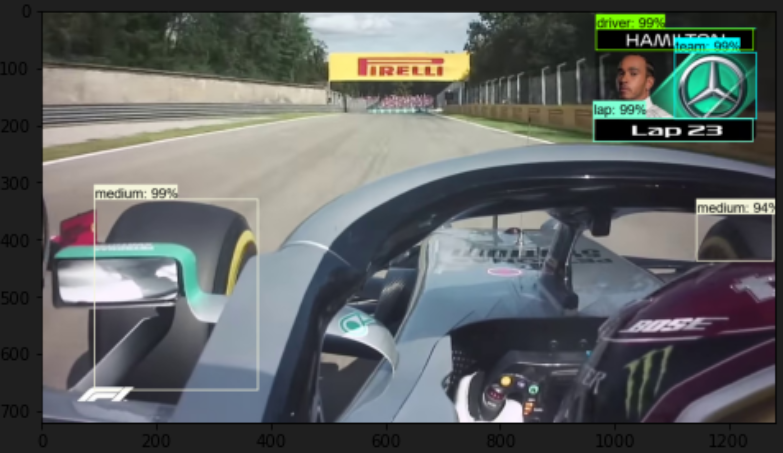

## F1 Tyre Compound Detection Project

This project was completed in 48 hours as part of a challenge.

Please do not rename files or move directories, or execution blockers may occur.

---

### Requirements

- TensorFlow 1.14.0
- Python 3.6.10

---

### Installation and Setup

1. **Python Environment**: Create a new Python environment with Python 3.6.10.
2. Activate the created environment.

    **For Conda users**:

    ```bash
    conda create --name tensorflow_14 python=3.6.10
    conda activate tensorflow_14
    cd F1_tyre_compound_detection
    ```

3. **Install Dependencies**:

    ```bash
    pip install -r requirements.txt
    ```

---

### Running the Model

The project contains four main files for testing:

1. **Object_detection_image.py**:  
    - Run `idle` in the console.
    - Use `Ctrl+o` to open the file.
    - Change line 35 to specify the testing image, then run the script with `F5`.

2. **Object_detection_video.py**:  
    - Follow the same steps as the first file.

3. **test_images_object_detection.ipynb**:  
    - Run the Jupyter notebook to visualize testing images with bounding boxes.

4. **object_detection_and_label_extraction.ipynb**:  
    - This notebook demonstrates how to crop identified bounding boxes for further processing.

---

### Model Performance Report

---

#### 1. Problem Definition

The problem consists in distinctly identifying four specific regions common across non-consecutive frames captured from a video. The video is a selection of on-board clips from the Monza 2019 F1 race and the regions to identify contain information related to tyre compound, driver, team and lap.

---

#### 2. Approach

The approach taken uses the open source TensorFlow Object Detection API to construct an object detection model. This API provides different pre-trained classifiers with specific neural network architectures to choose from depending on the problem statement. For this problem, a Faster-RCNN (Faster-RCNN with Resnet-50 V1) is chosen as it has proven to be the most accurate model by TensorFlow with high levels of accuracy compared to others despite it having a slower prediction time. Also, the FasterRCNN architecture is better suited for the type of data used in this problem, which consists of mid-high quality images with 1200x780 resolution.

---

#### 3. Methodology

The steps taken to build the object detection model are outlined in order:

1. **Frame Capture from Video**:  
Using the youtube_dl and the OpenCV library, videos are downloaded from YouTube and a frame is extracted and saved as JPEG every 300 frames. The videos used are from four different races and are all onboards: Monza 2019, Hungary 2019, Belgium 2019, and UK 2019. These videos have a good combination of onboard clips with soft, medium, hard and inter tyres. All extracted frames are used for training apart from 20 frames from Monza 2019 which are used for testing the object detection model.

2. **LabelImg**:  
LabelImg is used to annotate the images. There are 7 labels used during annotation: soft, medium, hard, inter, driver, team and lap.

3. **Prepare the Data**:  
The annotations from LabelImg are used to generate TensorFlow records for training and testing. The data is split for training and testing: 20 images for testing and 260 for training.

4. **Configure the Training**:  
The FasterRCNN config file (faster_rcnn_resnet50_coco.config) is configured for training and a label map is created (label_map.pbtxt). The configuration sets the labels, batch size, loss function, learning rate and paths. The label map is used to map the annotations to the label to be predicted.

5. **Run the Training, Monitor Training and Export Final Inference Graph**:  
The training ran for 2 hours and the model trained on GPU for a total of 9893 steps reaching a loss of 0.1218.

6. **Testing**:  
Two main files are used to test the model visually: Object_detection_image.py and Object_detection_video.py. There are also two Jupyter notebooks that further test the model: test_images_object_detection.ipynb and object_detection_and_label_extraction.ipynb. To assess training/testing performance the COCO detection evaluation metrics are used.

---

#### 4. Results

The COCO evaluation metrics are shown in the image in the footnotes at the end of the report. The metric in the red box is the Average Precision (AP) over multiple Intersection over Union (IoU) which is defined by COCO documentation as the primary metric. In simpler terms, it represents the mean average precision (mAP), which is the comparison between the ground-truth bounding box to the detected box. It has a value between 0 and 1 and the higher the value the more accurate the model is. In this case, the accuracy is ~80%. This means that on average the detected box covers between 50% and 95% of the ground truth box 80% of the times.


---

#### 5. Conclusion and Future Work

A model with 80% mAP can be considered a good model which is expected to perform well visually. A visual representation of a testing image is included in the footnotes. The file how_to_run_model.txt outlines step by step what needs to be done in order to run the visual detection.

Future work can be done to improve the complexity of the model. Further logic can be added to detect the driver’s name and to detect the team name. This can be done by specifying more labels and letting the model train for more than 2 hours in order to achieve a lower loss.

---

#### Model Enhancement Strategies

- **Hyperparameter Optimization**: Utilize grid search for optimal settings of learning rates and batch sizes.
- **Architecture Upgrade**: Consider EfficientDet for a balance between speed and accuracy.
- **Data Augmentation**: Use Generative Adversarial Networks to synthesize additional data.
- **Ensemble Methods**: Implement bagging to merge the predictive power of multiple models.
- **Post-Processing**: Apply non-max suppression for more accurate bounding boxes.
- **Real-Time Evaluation**: Test on edge devices to assess real-time performance.
- **User Feedback**: Incorporate a feedback mechanism for ongoing model improvement.

#### Sample Model Outputs





